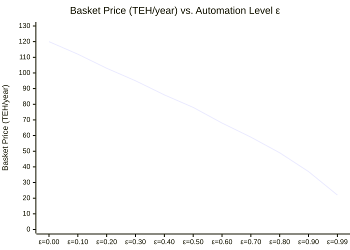
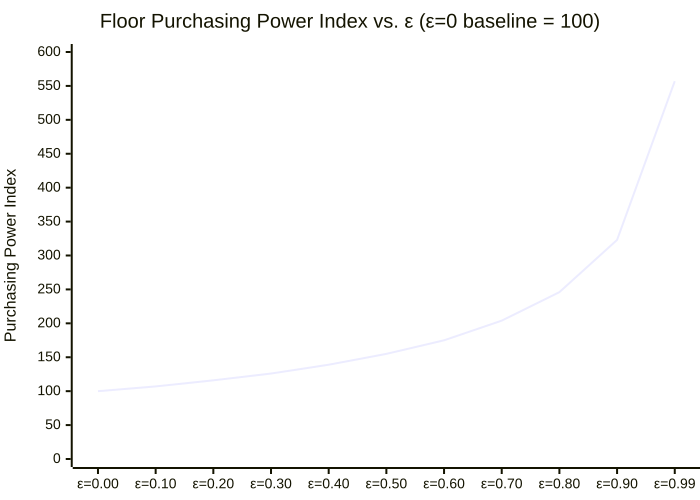
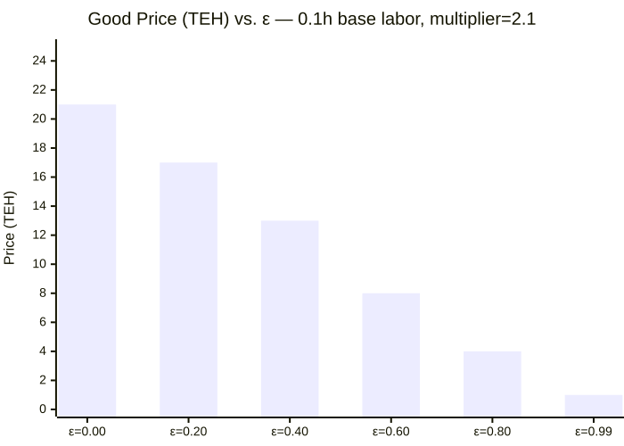
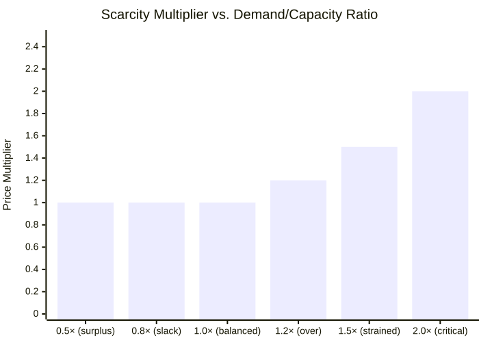

# Diagrams

Ten diagrams rendered from Mermaid source. Source `.mmd` files are in `diagrams/` (gitignored); rendered SVGs are committed to `docs/images/`.

To re-render a single diagram:
```bash
mmdc -i diagrams/<name>.mmd -o docs/images/<name>.svg -p ~/.config/mermaid/puppeteer.json
```

To re-render all:
```bash
for f in diagrams/*.mmd; do mmdc -i "$f" -o "docs/images/$(basename $f .mmd).svg" -p ~/.config/mermaid/puppeteer.json --quiet; done
```

---

## 1. EOH → TEH Pipeline

Physical reality generates entropy obligations. Machines and humans split the fulfillment. Registration gates how much human labor enters the collective ledger. TEH is created only from what is registered.



---

## 2. The Four EOH Domains

What each domain measures, what drives its magnitude, and its behavior at the extremes.



---

## 3. Price Mechanism — EOH vs. Classical Supply & Demand



---

## 4. Basket Price Falls with Automation

`basket_price(ε)` — TEH cost of the sufficiency basket. Goods (60%) decline steeply; services (40%) decline more slowly (care/knowledge resist automation). Both fall, so the floor's purchasing power rises automatically.



---

## 5. Floor Purchasing Power Rises with Automation (Principle 5)

Same nominal floor in TEH. Basket price falls. Baskets afforded rises — automatically, with no policy intervention required. Index: 100 = purchasing power at ε=0.



---

## 6. Good Price Falls with Automation

`teh_price(0.1h_base_labor, ε)` — price of a good requiring 0.1 hours of human labor at ε=0. Human labor content = `(1 − ε) × base_hours`. Floor at 5% prevents price reaching zero.



---

## 7. Demand Layer Stack

Three distinct demand zones in the EOH framework. Classical S/D conflates all three.



---

## 8. Scarcity Signal — domain_scarcity_multiplier()

The only S/D-like mechanism. Activates only when EOH demand exceeds fulfillment capacity. Corrective, not foundational. Resets once labor is redirected.



---

## 9. TEH Lifecycle — Creation and Destruction

TEH is created when registered human labor enters the ledger. Six destruction mechanisms close the circuit. Levies and Trust spending are circulatory (TEH moves, not destroyed).



---

## 10. Automation Arc — What Changes with ε


