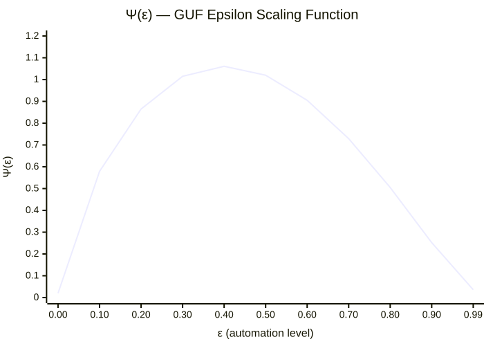

# Ground Use Fee Framework

*Based on NLSA TM-0042, extended with ε-parameterization, Trust integration, and collective extension points.*

This document specifies the complete mathematical framework for calculating Ground Use Fees (GUF) across all stewardship lease categories. The GUF is the annual temporal cost to the collective of granting exclusive use of a parcel to an individual or entity.

**Code implementation:** All GUF functions are in [`hours_eoh/land/guf.py`](../api/land.md). The CLI is `eoh guf` — see [CLI Reference](../guides/cli.md#guf-land-use-fee-commands).

**Framework connections:** The GUF upholds [Condition III](structural_conditions.md) (zero interest — all fee flows are circulatory TEH). The Ecological Write-Down provisions (§9) resolve the `eco-collapse-1` gap identified in the [EOH Accounting](eoh_accounting.md) framework.

---

## Preamble

This manual sets forth the complete mathematical framework for calculating Ground Use Fees (GUF) across all stewardship lease categories. The framework codifies the principle that land, as a finite common resource not created by human labor, cannot be priced under the standard Price-Labor Identity. Instead, the GUF represents the annual temporal cost to the collective of granting exclusive use of a parcel to an individual or entity.

This cost is derived from three physically grounded components: the opportunity value of the land to the community, the ecosystem-service displacement caused by its development, and the infrastructure burden of supporting its use.

All fees described herein are denominated in Time-Equivalent Hours (TEH) and are subject to the standard constitutional provisions governing temporal currency, including the zero-interest identity (Condition III) and the public auditability mandate.

**Epsilon parameterization.** Every mechanism in this framework is a function of ε, the observed automation level of the civilization. The NLSA specification gives the fee a bell-shaped arc: near a flat base at subsistence, peaking at moderate ε, contracting to a stewardship floor at post-scarcity. **The shipped fee does not follow that arc.** Ψ was retired as the default (author sign-off, 2026-08-20 — §4.2), so the fee responds to automation only through what a holding costs — labor content α(ε) in the base fee and replacement cost κ(ε) in the ecosystem term, both falling — and for a given serviced parcel it falls monotonically as ε rises. The low end of the NLSA arc survives in a different form: a remote parcel with no location value pays exactly zero at every ε, because the fee follows the absence of serviced land, not a scaling curve.

---

# 1. The Master Ground Use Fee Equation

## 1.1 General Form

The annual Ground Use Fee for any parcel p is calculated as:

```
GUF(p) = Ψ(ε) × [A(p) × L(p) × U(p,ε) × D(p) × Z(p) + E(p,ε) + I(p,ε)] × Ω(p)    (Eq. 1)
```

where:

**A(p)** = the area of parcel p, measured in standard land units (SLU), where 1 SLU = 100 square meters

**L(p)** = the Location Value Index for the parcel's position, a dimensionless coefficient reflecting relative spatial desirability

**U(p,ε)** = the Use Category Coefficient, reflecting the type and intensity of permitted use, parameterized by automation level

**D(p)** = the Demand Pressure Modifier, reflecting current population and economic pressure on land in the parcel's jurisdiction

**Z(p)** = the Zone Adjustment Factor, a dimensionless modifier (default 1.0) that captures jurisdictional zone-specific regulatory conditions not reflected in other components. Regional Land Boards may set Z within a range of 0.80 to 1.25 with published justification

**E(p,ε)** = the Ecosystem Displacement Surcharge, representing the TEH-equivalent value of natural services lost or diminished by the parcel's development, with labor-replacement costs parameterized by automation level

**I(p,ε)** = the Infrastructure Proximity Premium, representing the parcel's draw on collectively funded infrastructure, with construction costs reflecting the automation level at time of build

**Ψ(ε)** = the Epsilon Scaling Function, a global multiplier that shapes the GUF across the automation arc (see Section 4)

**Ω(p)** = the Occupancy Fraction, the share of the year the parcel is under active exclusive use (default 1.0; see Section 2.7)

The product `A(p) × L(p) × U(p,ε) × D(p) × Z(p)` constitutes the Base Fee, denominated in TEH per year. The terms E(p,ε) and I(p,ε) are additive surcharges, also in TEH per year.

## 1.2 Dimensional Analysis

A(p): SLU. L(p): dimensionless. U(p,ε): TEH/(SLU×year). D(p), Z(p): dimensionless (baseline 1.0). E(p,ε), I(p,ε): TEH/year. Ψ(ε): dimensionless. Ω(p): dimensionless (0 to 1).

Dimensional product: SLU × 1 × (TEH/SLU×year) × 1 × 1 = TEH/year. Full GUF: dimensionless × (TEH/year) × dimensionless = TEH/year. ✓



## 1.3 The GUF Floor

```
GUF(p) = max[GUF_floor(collective), GUF_formula(p)]    (Eq. 2)
```

Each collective defines its own GUF floor. Recommended default: 0.0 TEH/year. Conservation credits that would reduce the fee below the floor are handled separately through Trust disbursements — the GUF is always a non-negative transfer from steward to collective, and rewards for exceptional stewardship are a separate positive transfer from collective to steward.

---

# 2. Component Definitions and Calculation Methods

## 2.1 Parcel Area — A(p)

Parcel area is measured using standardized cadastral methods. One Standard Land Unit (SLU) equals 100 square meters. All parcels are measured to a precision of 0.01 SLU. For multi-story structures, A(p) refers to the ground footprint only — vertical development does not increase the GUF, incentivizing vertical density over horizontal sprawl.

!!! note "Extension point — Density Bonus"
    Collectives may implement a density bonus modifier that reduces effective A(p) for parcels exceeding a defined floor-area ratio (FAR) threshold. The default template applies no density bonus.

## 2.2 Location Value Index — L(p)

The Location Value Index captures the relative desirability of a parcel's geographic position, independent of structures or improvements.

```
L(p) = ω₁C(p) + ω₂T(p) + ω₃S(p) + ω₄N(p)    (Eq. 3)
```

| Sub-Index | Default Weight |
|-----------|----------------|
| ω₁ — Centrality | 0.35 |
| ω₂ — Transit Accessibility | 0.30 |
| ω₃ — Services Density | 0.20 |
| ω₄ — Natural Amenity | 0.15 |

Regional boards may adjust weights within ±0.10 of the default provided the total remains 1.0.



**Centrality (C(p)):** Gravity model for multi-center jurisdictions.
```
C(p) = Σ_k Z_k / d(p,k)^γ    (Eq. 4)
```
Normalized to 0–1 across the jurisdiction. γ = 1.5 metropolitan, 1.2 regional.

**Transit Accessibility (T(p)):** Destinations reachable within travel-time thresholds. Standard thresholds: 30 min employment, 20 min education, 15 min healthcare, 20 min commerce.

**Services Density (S(p)):** Essential service points within radius r_s, weighted by category. Healthcare λ=1.5, educational λ=1.3, food retail λ=1.0, general commerce λ=0.8, community facilities λ=0.7.

**Natural Amenity (N(p)):**
```
N(p) = Σ_f Q_f × e^(−δ · d(p,f))    (Eq. 8)
```
δ = 0.3 km⁻¹ recommended; max influence radius 10 km.

!!! warning "Removed: Residential Stability Index"
    Previous editions included a stability sub-index with a public safety component (Φ). Analysis identified a self-reinforcing feedback loop — higher incident rates → lower location value → lower investment → higher incidents. The index has been removed from the default template. Collectives wishing to include community maturity metrics must exclude incident-rate components and apply dampening to prevent self-reinforcing decline.

## 2.3 Use Category Coefficient — U(p,ε)

Reference values calibrated at ε = 0.40, scaled by the labor-content function:

```
U(p,ε) = U_ref(p) × α(ε)    (Eq. 9)
```

| Use Category | U_ref (TEH/SLU/yr) | Policy Rationale |
|---|---|---|
| Residential — Primary | 0.08–0.12 | Low rate to ensure housing accessibility |
| Residential — Secondary | 0.18–0.25 | Surcharge discourages speculative holding |
| Agricultural — Active | 0.01–0.03 | Near-nominal to support food production |
| Agricultural — Fallow/Transition | 0.04–0.06 | Modest increase incentivizes active use |
| Commercial — Retail | 0.20–0.40 | Reflects infrastructure intensity of trade |
| Commercial — Office/Services | 0.15–0.30 | Moderate rate for service-sector activity |
| Industrial — Light | 0.12–0.22 | Balances production needs with impact |
| Industrial — Heavy | 0.25–0.50 | Higher rate reflects environmental burden |
| Institutional — Public Service | 0.00–0.02 | Near-zero for hospitals, schools, etc. |
| Mixed Use | Weighted blend | Proportional to floor area per use type |
| Conservation Overlay | −0.02 to −0.10 | Credit for maintained ecological function |

The Conservation Overlay carries a negative coefficient. If the credit drives the total below the GUF floor, the fee is clamped at the floor; rewards beyond the floor are disbursed separately from the Trust.

## 2.4 Demand Pressure Modifier — D(p)

```
D(p) = 1 + η × ln(1 + Δ(p))    (Eq. 11)
```

where Δ(p) = (W_demand − W_supply) / W_supply. η = 0.15 residential, 0.25 commercial.

```
D(p) ≤ D_max = 1.8    (Eq. 13)
```

Logarithmic form ensures diminishing sensitivity. Never drops below 1.0.

**Zone Adjustment Factor Z(p):** Set by Regional Land Board. Default 1.0; permitted range 0.80–1.25. Values outside this range require national oversight approval.

## 2.5 Ecosystem Displacement Surcharge — E(p,ε)

The most philosophically novel component. Derived from the estimated labor-time required to replace natural services:

```
E(p,ε) = Σ_s V_s(p) × κ_s(ε) × (1 − ρ_s(p))    (Eq. 14)
```

where V_s(p) is annual natural service volume, κ_s(ε) is labor-time replacement cost, and ρ_s(p) is the retained service fraction.

**κ_s(ε) functional form:**
```
κ_s(ε) = κ_s_max × (1 − ε)^(β_s) + κ_s_floor    (Eq. 15)
```

| Service Category | Physical Unit | κ at ε=0.40 (TEH/unit/yr) | β_s |
|---|---|---|---|
| Water filtration | Megalitres filtered/year | 0.8–2.5 | 0.8 |
| Flood attenuation | Cubic metres retained/event | 0.002–0.01 | 0.7 |
| Carbon sequestration | Tonnes CO₂eq/year | 1.5–4.0 | 0.9 |
| Air quality regulation | Tonnes particulate removed/yr | 3.0–8.0 | 1.0 |
| Pollination support | Hectare-equivalents served | 0.5–1.5 | 0.6 |
| Biodiversity habitat | Habitat quality units (HQU) | 0.1–0.6 | 0.7 |
| Thermal regulation | Cooling degree-days mitigated | 0.01–0.05 | 0.8 |

Retained service fractions (ρ_s) are assessed by certified Ecosystem Auditors at each 5-year review cycle. Leaseholders who improve ρ values between cycles see their surcharge decrease at the next review.

## 2.6 Infrastructure Proximity Premium — I(p,ε)

```
I(p,ε) = Σ_k [H_k(ε_k) / (Y_k × B_k)] × e^(−μ_k · d(p,k)) × χ(p,k)    (Eq. 16)
```

H_k: total TEH invested in asset k at automation level ε_k. Y_k: design life in years. B_k: beneficiary parcel count. μ_k: distance-decay rate (0.5 km⁻¹ transit, 0.2 km⁻¹ utilities, 0.8 km⁻¹ public spaces).

Legacy assets built at lower ε retain their original H_k values — the labor was real. Over time, as legacy assets are replaced with lower-TEH-cost infrastructure, aggregate I(p) contracts.

## 2.7 Occupancy Fraction — Ω(p)

```
Ω(p) ∈ (0.0, 1.0],  default = 1.0    (Eq. 17)
```

For nearly all parcels Ω = 1.0. Exclusive use is exclusive regardless of physical presence — the collective is excluded year-round. Extension point for time-shared or seasonal parcels.

---

# 3. The GUF Floor Constraint

Conservation credits may reduce the base fee but cannot drive the total GUF below the collective's defined floor. Where stewardship produces outcomes beyond zero-fee status, the mechanism is a Trust disbursement (stewardship reward), not a negative GUF. This preserves the ledger identity: a negative GUF would constitute TEH flowing to the steward without a corresponding labor record.

---

# 4. Epsilon Parameterization

## 4.1 The Arc Shape

**The shipped fee (`psi_policy="retired"`).** Monotone in ε for a given parcel, because both of its cost responses — α(ε) and κ(ε) — fall:

- **ε = 0:** Labor content is highest, so a *serviced* parcel pays about half again its ε = 0.40 fee. A parcel with no location value pays exactly zero at every ε.
- **ε = 0.40:** The calibration reference. All three Ψ policies agree exactly here, because Ψ(0.40) = 1 by construction.
- **ε = 0.99:** Labor content has collapsed and the fee falls to roughly a tenth of its reference value.

**The NLSA arc (`psi_policy="bell"`), kept as the published specification:**

- **ε = 0:** Land possession linked to personal EOH fulfillment. Minimal institutional infrastructure. GUF approaches a flat base.
- **ε = 0.30–0.60:** Urbanization intensive. Institutional capacity high. Demand peaks. Infrastructure substantial. GUF at maximum.
- **ε = 0.99:** Labor costs collapsed. Infrastructure maintenance automated. Fee falls to stewardship-only floor.

The bell was retired because its two ends fail for different reasons: at the high end Ψ repeats α's "labor costs collapse" (one mechanism counted twice), and at the low end it nets a claim about whether a fee can be *collected* against what a holding *costs*.



## 4.2 The Epsilon Scaling Function — Ψ(ε)

!!! warning "Retired as the shipped default (author sign-off, 2026-08-20)"
    The model runs with Ψ ≡ 1 (`psi_policy="retired"`). Ψ duplicated α's
    response to falling labour content at the high end — two terms encoding one
    mechanism — and made a category error at the low end. The fee's ε-response
    is carried by α (§4.3). This section is kept as the NLSA specification, and
    `psi_policy="bell"` still applies it. §4.1 and §4.4 give both the shipped
    and the NLSA behaviour.

```
Ψ(ε) = 4ε^a × (1 − ε)^b + Ψ_floor    (Eq. 18)
```

| Parameter | Recommended Value | Effect |
|---|---|---|
| a | 0.8 | Controls rise speed from ε = 0 |
| b | 1.2 | Controls fall speed toward ε = 1 |
| Ψ_floor | 0.02 | Minimum scaling at extremes |

This produces a bell-shaped curve: Ψ(ε=0) ≈ 0.02, Ψ(ε=0.99) ≈ 0.03, and a peak at ε = a/(a+b) = 0.40. With the NLSA's leading coefficient of 4 the peak is ≈ 1.06, which is what the §11 worked example uses. **The code derives that coefficient from a, b and the floor instead (`GUF_PSI_NORM`), so its peak is exactly 1.00** — the NLSA's 4 claimed to normalize the curve to 1 and did not.

## 4.3 The Labor-Content Scaling Function — α(ε)

```
α(ε) = (1 − ε)^ζ + α_floor    (Eq. 19)
α_normalized(ε) = α(ε) / α(0.40)    (Eq. 20)
```

ζ = 0.8 recommended; α_floor = 0.05. Normalized so α(0.40) = 1.0.

## 4.4 Boundary Verification

| ε | NLSA check (`bell`) | Shipped fee (`retired`) |
|---|---|---|
| 0.00 | GUF < 0.05 × GUF(ε=0.40) | A serviced parcel pays **more** than at the reference; a parcel with no location value pays exactly 0 |
| 0.40 | GUF matches published reference rates | Identical to `bell` — Ψ(0.40) = 1 |
| 0.90 | GUF < 0.25 × GUF(ε=0.40) | Under a third of the reference, **not** under a quarter |
| 0.99 | GUF < 0.05 × GUF(ε=0.40) | Roughly a tenth of the reference — **this NLSA condition does not survive**; it is the cost terms falling without Ψ's second discount |

The NLSA conditions that fail under the default are recorded as a consequence of the retirement, not relaxed to pass.

**Tests:** `tests/test_land_guf.py` pins both §4.4 end conditions under `psi_policy="bell"`, pins that they do **not** hold under the default (the fee is higher at ε = 0 and lower at ε = 0.90 than at the reference), and pins the exact zero for a parcel with no location value. The shape words in §4.1 and this table ("about half again", "under a third", "roughly a tenth") are pinned as ranges on both the urban archetype and the §11 parcel.

---

# 5. Rate Change Constraints and Transition Protections

## 5.1 The Review Cycle Cap

GUF rates are recalculated every 5 years. To prevent displacement through sudden fee increases:

```
GUF_applied(t) = min[GUF_formula(t), GUF_applied(t−1) × (1 + φ)]    (Eq. 22)
```

φ = 0.10 (10% per cycle). A 40% true increase takes ~4 cycles (20 years) to fully apply.

!!! note "Extension point — Long-Tenure Dampening"
    Collectives may reduce φ for long-established households (e.g., φ_tenure = 0.05 for tenure > 25 years) to slow (but not prevent) fee increases near surrounding development. This is a policy choice with fiscal cost — model the aggregate revenue impact.

## 5.2 The Income-Linked Subsidy

For residential primary parcels, effective GUF is modified by income:

```
σ(Y) = 0.25                                    if Y < 0.4Ŷ    (Eq. 24a)
σ(Y) = 0.25 + 0.75 × [(Y − 0.4Ŷ) / (0.6Ŷ)]  if 0.4Ŷ ≤ Y < Ŷ  (Eq. 24b)
σ(Y) = 1.0                                     if Y ≥ Ŷ         (Eq. 24c)
```

Y = annual post-levy income; Ŷ = national median. Leaseholders below 40% of median pay 25% of GUF. Subsidy cost is funded from the Trust's land fund.

---

# 6. Lease Structure

Stewardship leases are indefinite, subject to 5-year review cycles. Conditions for continued lease: GUF payment, permitted use compliance, maintenance preventing net degradation, conservation overlay adherence.

**Transfer:** Voluntary transfer is a zero-cost ledger event — no TEH created or destroyed. The land carries no price; only structures may be separately valued.

**Reassignment queue (priority):**

| Level | Description |
|---|---|
| 1 — Dependents | Household members of previous steward |
| 2 — Community members | Registered members of the local community |
| 3 — Collective members | Any member of the broader collective |
| 4 — Public hold | Collective public land |

---

# 7. Revenue Flow and Trust Integration

All GUF revenue is circulatory TEH — it moves TEH from stewards to the collective without creating or destroying currency. All revenue flows into the Trust.

At moderate to high ε, GUF may become the Trust's largest revenue source as the levy base contracts with automation. This makes the land fund structurally important to long-run Trust solvency.



!!! note "Extension point — Split Allocation"
    Collectives may elect to split GUF revenue between the general Trust fund and a dedicated ecology fund. The ecology fund may be used exclusively for ecological EOH fulfillment, ecological capital write-down events, and regenerative offset investments.

**Stewardship Rewards:** Where conservation practices exceed what the GUF credit mechanism covers, the Trust may disburse TEH as a stewardship reward — a separate positive transfer backed by verified ecological EOH fulfillment. Never netted against the GUF in the ledger.

---

# 8. Cross-Collective Infrastructure

```
χ(p,k) = 1.0     if asset k is owned by parcel p's collective    (Eq. 25a)
χ(p,k) = χ_ext   if asset k is owned by a different collective   (Eq. 25b)
```

χ_ext = 0.3 recommended. The benefiting collective does not bear the maintenance EOH, so the reduced weighting reflects benefit without corresponding obligation.

---

# 9. Ecological Write-Down Events and the GUF

Ecological systems do not degrade linearly — they absorb stress and then collapse abruptly when a threshold is crossed. The Newfoundland cod collapse (1992) illustrates this: the fishery functioned until it did not, displacing 35,000 workers and triggering a moratorium that lasted thirty-two years.

## 9.1 The GUF Paradox Under Collapse

When an ecosystem collapses, V_s(p) drops → E(p,ε) falls → GUF revenue from the affected zone *decreases at precisely the moment when ecological obligations have spiked*. Left unaddressed, this paradox rewards degradation. Section 9 defines the mechanisms that prevent it.

## 9.2 Write-Down Declaration

An ecological write-down is triggered when the collective's ecological assessment body determines that a defined ecosystem has crossed an irreversibility threshold. Declaration must be supported by physical evidence (Guardrail I): sensor data, ecological monitoring, biological surveys, engineering assessments.

The declaration specifies: affected zone (by parcel registry), services lost, restoration assessment (recoverable vs. permanently altered), and causal analysis (attributing contribution drivers).

## 9.3 The V_s Baseline Reset

**Restoration pathway:** V_s(p) is reset to the *restoration target state* — service levels the ecosystem is expected to provide once restoration labor is complete. E(p,ε) is calculated against where the ecosystem is going, preventing the paradox of reduced fees in degraded zones.

```
V_s_reset(p) = V_s_target(p),  if restoration committed    (Eq. 27)
```

**Abandonment pathway:** V_s(p) is reset to the degraded baseline (E(p,ε) falls). A **Rebuilding Surcharge** R_b(p,ε) is added for all parcels in the affected zone:

```
R_b(p,ε) = Σ_s [V_s_lost(p) × κ_s(ε)] / Y_r    (Eq. 28)
```

V_s_lost(p) = pre-collapse minus post-collapse service volumes. Y_r = amortization period (recommended: 50 years). The surcharge is distributed across all affected parcels, weighted by area.

**Code:** `hours_eoh/land/guf.py` → `rebuilding_surcharge()`

## 9.4 Modified GUF Under Write-Down

```
GUF_wd(p) = Ψ(ε) × [A(p)×L(p)×U(p,ε)×D(p)×Z(p) + E_reset(p,ε) + I(p,ε) + R_b(p,ε)] × Ω(p)    (Eq. 29)
```

E_reset uses the reset V_s baseline; R_b = 0 under restoration, positive under abandonment. The 10% per-cycle rate cap still applies.

**Code:** `hours_eoh/land/guf.py` → `ground_use_fee_writedown()`

## 9.5 Historical Contribution Assessment

The default template distributes the rebuilding surcharge by area across all parcels in the affected zone, regardless of individual culpability. An extension point allows contribution-weighted distribution using historical ρ_s scores.

## 9.6 Fiscal Flow Under Write-Down

Write-down events are funded from the Trust's ecological allocation with priority access ahead of routine stewardship. The rebuilding surcharge revenue from affected parcels flows back into the Trust, partially offsetting the increased draw.

## 9.7 Recovery Monitoring

At each 5-year review cycle, the ecological assessment body reassesses service levels. Under the restoration pathway, write-down status is formally closed when the ecosystem reaches the target state. Under abandonment, unexpected natural recovery may allow reclassification.

Full recovery is rare and typically measured in decades. The framework does not assume recovery — it funds the response, monitors the trajectory, and adjusts the GUF when physical reality warrants.

## 9.8 Preventive Signal: The EOH Accumulation Warning

When unfulfilled ecological EOH exceeds a warning threshold (recommended: 0.30, meaning 30% of obligations are unfulfilled), the assessment body issues a formal accumulation warning, triggering:

1. **Accelerated ρ_s review** — extraordinary review of retained service fractions for all parcels in the warned zone
2. **Trust ecology fund priority** — warned zone receives priority allocation for directed stewardship labor

```
ratio = unfulfilled_eoh / total_eoh
warning = ratio > threshold
```

**Code:** `hours_eoh/land/guf.py` → `eoh_accumulation_warning()`



---

# 10. Special Provisions

## 10.1 Zero-Income and Sufficiency Guarantee Parcels

For Sufficiency Guarantee recipients: σ = 0.0, effective GUF = zero. Full formula-derived GUF absorbed by the Trust's sufficiency allocation.

## 10.2 Agricultural Soil-Health Credit

```
ΔGUF_soil = −c_soil × A(p) × ΔSHI(p)    (Eq. 26)
```

ΔSHI(p) = change in Soil Health Index (organic matter, microbial activity, water retention, nutrient cycling; scaled 0–1). c_soil = 0.05 TEH/SLU per SHI point recommended. Applied before the GUF floor.

## 10.3 Transition-Era Legacy Parcels

Parcels converted from pre-TEH ownership carry a historical baseline GUF. These converge toward the standard formula as review cycles accumulate, governed by the same rate-change cap.

---

# 11. Worked Example: Residential Parcel at ε = 0.40

**Parcel:** Mid-density residential, 4.2 km from city center. Area: 3.5 SLU. Use: Residential Primary. Green cover: 35% native landscaping. Nearest transit: 800 m (45,000 TEH cost, 50-yr life, 1,800 parcels). Nearest park: 400 m (8,000 TEH, 75-yr life, 500 parcels). Leaseholder income: 3,200 TEH/yr. National median: 3,500 TEH/yr. Z(p) = 1.0. Ω(p) = 1.0.

!!! note "This is the published NLSA example, not the shipped fee"
    It is reproduced as the regression anchor and differs from what
    `ground_use_fee()` computes today in three declared ways:

    - **Ψ is 1.0 at ε = 0.40, not 1.06** — retired by default (Ψ ≡ 1), and normalized to peak at exactly 1.00 even under `bell` (§4.2) — so Step 5's bracket is not scaled.
    - **The use coefficient ships at a hundred times the NLSA rate** (`GUF_USE_*`, an open item — see `record/guf.md`), so the base fee is a hundred times Step 2's.
    - **A per-parcel term is added outside the bracket** (adopted 2026-08-30), which Eq. 1 does not have.

    `tests/test_land_guf.py` asserts the example's components against the code at a zero per-parcel rate, and asserts the shipped fee as the example plus the term, so the differences are demonstrated rather than hidden.

**Step 1: Epsilon Scaling Function**

```
Ψ(0.40) = 4 × 0.40^0.8 × (1 − 0.40)^1.2 + 0.02
         = 4 × 0.481 × 0.542 + 0.02
         = 1.041 + 0.02 ≈ 1.06
```

**Step 2: Base Fee**

```
A(p)          = 3.5 SLU
L(p)          = 0.35×0.55 + 0.30×0.71 + 0.20×0.68 + 0.15×0.58 = 0.629
U(p, 0.40)    = 0.10 × α(0.40) = 0.10 × 1.0 = 0.10 TEH/SLU/yr
D(p)          = 1 + 0.15 × ln(1 + 0.15) = 1.021
Z(p)          = 1.0

Base Fee = 3.5 × 0.629 × 0.10 × 1.021 × 1.0 = 0.225 TEH/yr
```

**Step 3: Ecosystem Displacement Surcharge**

Services: water filtration 0.4 ML/yr (κ=1.2, ρ=0.30), carbon 0.15 t/yr (κ=2.5, ρ=0.25), thermal 12 CDD (κ=0.03, ρ=0.20).

```
E(p) = [0.4×1.2×(1−0.30)] + [0.15×2.5×(1−0.25)] + [12×0.03×(1−0.20)]
     = 0.336 + 0.281 + 0.288 = 0.905 TEH/yr
```

**Step 4: Infrastructure Proximity Premium**

```
Transit: [45,000 / (50 × 1,800)] × e^(−0.5×0.8) × 1.0 = 0.500 × 0.670 = 0.335
Park:    [8,000 / (75 × 500)] × e^(−0.8×0.4) × 1.0  = 0.213 × 0.726 = 0.155

I(p) = 0.335 + 0.155 = 0.490 TEH/yr
```

**Step 5: Total GUF Before Adjustments**

```
GUF_formula = 1.06 × [0.225 + 0.905 + 0.490] × 1.0
            = 1.06 × 1.620 = 1.718 TEH/yr
```

**Step 6: Review Cycle Cap**

Previous cycle: 1.52 TEH/yr. Cap: 1.52 × 1.10 = 1.672 TEH/yr. Since 1.718 > 1.672, the cap binds.

```
GUF_applied = 1.672 TEH/yr  (excess of 0.046 deferred to next cycle)
```

**Step 7: Income-Linked Subsidy**

Y = 3,200 TEH. Ŷ = 3,500 TEH. 0.4Ŷ = 1,400. 0.6Ŷ = 2,100.

```
σ(3200) = 0.25 + 0.75 × [(3,200 − 1,400) / 2,100] = 0.25 + 0.643 = 0.893
GUF_effective = 1.672 × 0.893 = 1.493 TEH/yr
```

**Result:** The leaseholder pays 1.493 TEH per year (~0.124 TEH/month), approximately 0.5% of annual post-levy income.

---

# 12. Governance, Audit, and Appeals

All GUF calculations are performed using standardized data inputs from geodetic survey, spatial economics, ecosystem services, and the infrastructure registry. All inputs, intermediate calculations, and final determinations are published on the public GUF Ledger.

Leaseholders may appeal within 180 days of each review cycle publication. Common grounds: disputed Location Value Index sub-scores (~45% of appeals), disputed Ecosystem Displacement assessments (~25%), disputed Retained Service Fractions (~20%), zone adjustment challenges (~10%).

The land stewardship authority is subject to annual audit by the temporal ledger authority.

---

# 13. Template Extension Points Summary

| Extension Point | Section | Default | Collective Defines |
|---|---|---|---|
| Density Bonus | 2.1 | None | FAR threshold, reduction formula, minimum floor |
| Community Maturity Metrics | 2.2.6 | Not included | Sub-index, dampening, feedback monitoring |
| Epsilon Shape Parameters | 4.2 | Retired (Ψ ≡ 1); NLSA a=0.8, b=1.2, floor=0.02 under `psi_policy="bell"` | Whether to reinstate a scaling curve, and its shape |
| GUF Floor | 1.3 | 0.0 TEH/yr | Any non-negative value |
| Zone Adjustment Range | 2.4.1 | Z=1.0 (range 0.80–1.25) | Zone designations and justifications |
| Occupancy Fraction | 2.7 | Ω=1.0 | Qualifying categories, verification rules |
| Long-Tenure Dampening | 5.1 | No dampening | Tenure threshold, reduced φ, fiscal impact model |
| Trust Revenue Split | 7.1 | 100% general fund | Split ratio, ecology fund rules |
| Cross-Collective χ | 8.1 | χ_ext=0.3 | Bilateral agreements, symmetry requirement |
| Reassignment Mechanism | 6.2 | Priority queue | Queue rules or custom method |
| Additional Ecosystem Services | 2.5.1 | 7 categories | New service definitions, κ values, β parameters |
